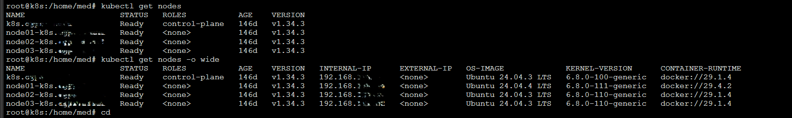
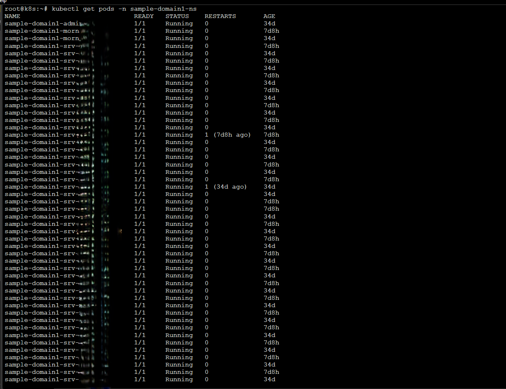
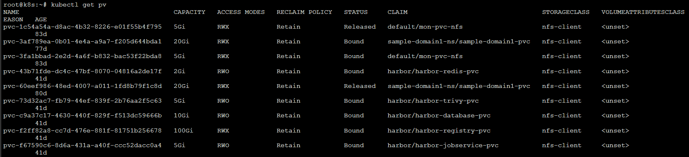
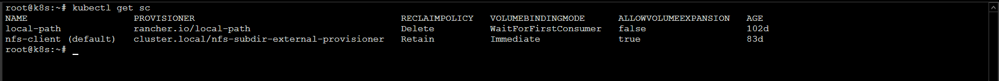

# Oracle WebLogic on Kubernetes

> Production-grade deployment of Oracle WebLogic Server on Kubernetes using the **WebLogic Kubernetes Operator (WKO) 4.3.7**

[](https://kubernetes.io/)
[](https://oracle.github.io/weblogic-kubernetes-operator/)
[](https://kubernetes.io/docs/concepts/storage/volumes/#nfs)
[](https://kubernetes.github.io/ingress-nginx/)

---

## Overview

This project documents the end-to-end deployment of **Oracle WebLogic Server** on a multi-node Kubernetes cluster, simulating a real enterprise environment. It uses the **WebLogic Kubernetes Operator (WKO)** to manage WebLogic domains natively within Kubernetes, with NFS-backed persistent storage and subdomain-based NGINX ingress routing.

The domain `AmenAll` hosts **~28 standalone Managed Servers**, each representing a regional delegation, all running on a shared NFS volume with `RWX` access mode.

---

## Architecture

```
┌─────────────────────────────────────────────────────────────────┐
│                        Kubernetes Cluster                        │
│                                                                 │
│  ┌──────────────┐   ┌──────────────────────────────────────┐   │
│  │  Master Node │   │            Worker Nodes (x3)          │   │
│  │  (Control    │   │                                       │   │
│  │   Plane)     │   │  ┌──────────┐ ┌──────────┐ ┌──────┐ │   │
│  └──────────────┘   │  │ Worker-1 │ │ Worker-2 │ │ W-3  │ │   │
│                     │  └──────────┘ └──────────┘ └──────┘ │   │
│                     └──────────────────────────────────────┘   │
│                                                                 │
│  ┌────────────────┐   ┌──────────────┐   ┌─────────────────┐  │
│  │  WKO Operator  │   │ Admin Server │   │ Managed Servers  │  │
│  │  (wko-ns)      │   │  (Pod)       │   │  (~28 Pods)      │  │
│  └────────────────┘   └──────────────┘   └─────────────────┘  │
│                                                                 │
│  ┌──────────────────────────────────────────────────────────┐  │
│  │           NGINX Ingress — Subdomain Routing               │  │
│  │         *.cgpr.local → NodePort (30080/30443)            │  │
│  └──────────────────────────────────────────────────────────┘  │
└─────────────────────────────────────────────────────────────────┘
                              │
                    ┌─────────▼──────────┐
                    │    NFS Server       │
                    │  (StorageClass:     │
                    │   nfs-client, RWX)  │
                    └─────────────────────┘
```

---

## Infrastructure

| Component        | Details                          |
|------------------|----------------------------------|
| Master Node      | 1x (kubeadm)                     |
| Worker Nodes     | 3x                               |
| CPU per Node     | 32 cores                         |
| RAM per Node     | 32 GB                            |
| Storage          | NFS Server (RWX, nfs-client SC)  |
| OS               | Linux (Ubuntu)                   |

---

## Technologies

| Tool / Technology              | Role                                      |
|-------------------------------|-------------------------------------------|
| Kubernetes (kubeadm)          | Container orchestration                   |
| WebLogic Kubernetes Operator 4.3.7 | Domain lifecycle management          |
| Oracle WebLogic Server 14.x   | Application server                        |
| Docker                        | Container image runtime                   |
| NFS                           | Shared persistent storage (RWX)           |
| NGINX Ingress Controller      | Subdomain-based HTTP/HTTPS routing        |
| Persistent Volumes (PV/PVC)   | Storage abstraction for domain home       |
| nfs-client StorageClass       | Dynamic NFS provisioning                  |

---

## WebLogic Domain

| Parameter         | Value                          |
|-------------------|-------------------------------|
| Domain Name       | `AmenAll`                     |
| Domain Type       | Model in Image / Domain Home on PV |
| Admin Server      | 1 Pod                         |
| Managed Servers   | ~28 standalone servers        |
| Topology          | Standalone (migration to clusters planned) |
| Storage           | NFS RWX PVC                   |

---

## Project Structure

```
oracle-weblogic-on-kubernetes/
├── kubernetes/
│   ├── domain.yaml              # WKO Domain CRD manifest
│   ├── pv.yaml                  # Persistent Volume (NFS)
│   ├── pvc.yaml                 # Persistent Volume Claim
│   ├── ingress.yaml             # NGINX Ingress (subdomain routing)
│   ├── secrets/
│   │   ├── domain-credentials-secret.yaml
│   │   └── runtime-encryption-secret.yaml
│   └── operator/
│       └── wko-values.yaml      # Helm values for WKO installation
├── weblogic/
│   └── config/                  # WebLogic domain configuration files
├── screenshots/
│   ├── cluster-nodes.png
│   ├── pods-running.png
│   ├── pv-pvc.png
│   ├── pv-pv.png
│   ├── domain.png
│   └── nfs-storage.png
└── README.md
```

---

## Prerequisites

- Kubernetes cluster (1 master + 3 workers) provisioned with `kubeadm`
- `kubectl` configured and pointing to the cluster
- Helm 3.x installed
- NFS server accessible from all nodes, with `/export/domain` shared
- Oracle WebLogic Docker image pulled and available (requires Oracle account)
- `nfs-client` StorageClass deployed (via `nfs-subdir-external-provisioner`)

---

## Deployment Steps

### 1. Install the WebLogic Kubernetes Operator

```bash
helm repo add weblogic-operator https://oracle.github.io/weblogic-kubernetes-operator/charts
helm repo update

kubectl create namespace wko-ns
kubectl create namespace weblogic-ns

helm install weblogic-operator weblogic-operator/weblogic-operator \
  --namespace wko-ns \
  --set "domainNamespaces={weblogic-ns}" \
  --wait
```

### 2. Create Kubernetes Secrets

```bash
# WebLogic admin credentials
kubectl create secret generic domain-credentials \
  --from-literal=username=weblogic \
  --from-literal=password=<your-password> \
  --namespace weblogic-ns

# Runtime encryption secret (required by WKO)
kubectl create secret generic runtime-encryption-secret \
  --from-literal=password=<encryption-password> \
  --namespace weblogic-ns
```

### 3. Provision Persistent Storage

```bash
kubectl apply -f kubernetes/pv.yaml
kubectl apply -f kubernetes/pvc.yaml

# Verify
kubectl get pv,pvc -n weblogic-ns
```

### 4. Deploy the WebLogic Domain

```bash
kubectl apply -f kubernetes/domain.yaml

# Watch pods come up
kubectl get pods -n weblogic-ns -w
```

### 5. Configure Ingress

```bash
kubectl apply -f kubernetes/ingress.yaml

# Verify routing
kubectl get ingress -n weblogic-ns
```

Access the Admin Console at: `http://admin.cgpr.local:30080/console`

---

## Screenshots

### Cluster Nodes


### Running Pods


### Persistent Volume & Claim


### Persistent Volume Details


### WebLogic Domain


### NFS Storage


---

## Key Design Decisions

**Why NFS over block storage (Fibre Channel)?**
NFS with `ReadWriteMany (RWX)` is required for the WebLogic domain home to be accessible simultaneously by the Admin Server and all Managed Server pods. Block storage (FC/iSCSI) only supports `RWX` with specific cluster file systems (OCFS2, GFS2), adding unnecessary complexity.

**Why standalone servers instead of WebLogic clusters?**
Each of the ~28 Managed Servers represents an independent regional delegation with its own application scope. A migration to WKO-managed clusters (`Cluster` CRDs with pod anti-affinity) is planned for a future phase to enable horizontal scaling.

**Why subdomain-based ingress routing?**
Using `*.cgpr.local` with subdomain rules allows each server (e.g., `manouba.cgpr.local`, `ariana.cgpr.local`) to be accessed independently through a single NGINX Ingress controller, without path conflicts.

---

## Author

**Mohamed** — CKA Certified Kubernetes Administrator | DevOps / System Administrator  
`Docker` • `Kubernetes` • `Git` • `Jenkins` • `WebLogic` • `NFS` • `NGINX`

---

## License

This project is for demonstration and portfolio purposes.
